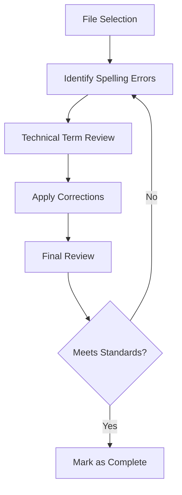

# Documentation Quality Improvement Architecture

## Overview
This document outlines the technical approach for implementing spelling corrections across the repository's documentation.

## Architecture Decisions

### 1. Documentation Structure
- Maintain existing file structure
- No changes to formatting or organization
- Preserve all technical content

### 2. Quality Control Process

### 3. Tools and Standards
- Manual spelling review
- Technical term preservation
- Version control for changes

### 4. Implementation Approach
1. File-by-file spelling correction
2. Immediate commit after each file
3. Regular push to maintain progress
4. Pull request for each completed story

## Technical Requirements
- Only spelling corrections
- Preserve all technical terms
- Maintain existing file structure
- Follow project's commit conventions

## Approval Status
- [x] Approved
- [ ] Needs Review
- [ ] Rejected 