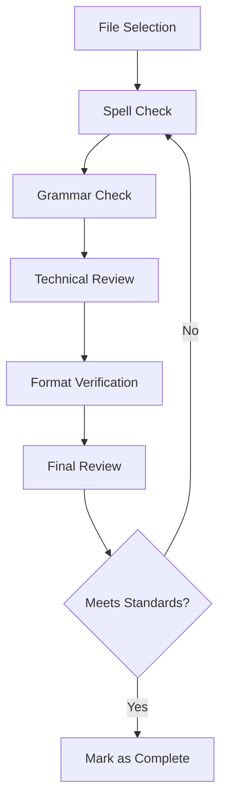

# Documentation Quality Improvement Architecture

## Overview
This document outlines the technical approach for implementing documentation quality improvements across the repository.

## Architecture Decisions

### 1. Documentation Structure
- Maintain existing directory structure
- Preserve current markdown formatting standards
- Follow established .mdc file organization for rules

### 2. Quality Control Process

### 3. Tools and Standards
- Use of markdown linting tools for consistency
- Automated spell checking with technical term exceptions
- Manual review for grammar and clarity
- Version control for tracking changes

### 4. Implementation Approach
1. File-by-file sequential improvement
2. Immediate commit after each file completion
3. Regular push to maintain progress
4. Pull request for each completed story

## Technical Requirements
- Markdown-compliant changes only
- Preserve all code blocks and technical content
- Maintain existing file structure
- Follow project's established commit conventions

## Approval Status
- [ ] Approved
- [ ] Needs Review
- [ ] Rejected 