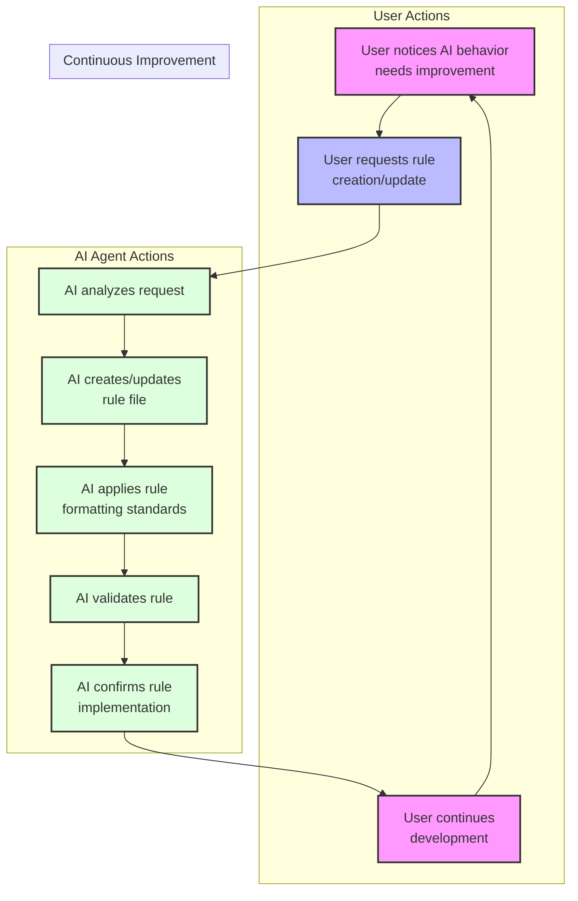

# Cursor Automatic Rules Generation with Agile Cursor Workflow Template

[Video Demo and Walkthrough](https://youtu.be/jEhvwYkI-og) - More cursor videos coming so please subscribe if you like the video!

NOTE: This has been tested with Claud Sonnet 3.5 - YMMV with other models reliability.

This is a template for establishing automatic generation of self improving granular rules for AI agents using Cursor's rule system. The core philosophy is that users should never need to manually create or update rules - instead, the AI agent handles rule creation and maintenance through natural language requests in a consistent format and style that:

- Ensures Rules are used automatically when appropriate
- Used specifically if desired on demand
- Does not suffer from write issues where other rule systems fail

> 💡 **Note:** For a complete guide to the Agile-Cursor Workflow system that helps manage your project with exceptional memory and consistency, see [Agile Workflow Documentation](docs/agile-readme.md).

## IMPORTANT INFORMATION ABOUT THIS TEMPLATE

Granular Rules and custom workflows are the key to getting the most out of the AI in composer mode - and with this you can automatically generate and maintain rules rapidly so your agent constantly improves and learns from its mistakes.

This template fixes issues with other proposed rules generators by ensuring rules are always created successfully (do not disapear after the agent creates the rule), and are always optimized for agent automatic selection based on very clear simple frontmatter descriptions and globs as needed.

Also a lot of research has gone into the best way to format rules - as there are so many competing and half baked theories - through a lot of research, mining forums and studies, the official docs for Claude prompt engineering, Cline recommendations, cursor developer comments in reddit and forums, the rules will follow a general format of:

- Frontmatter with description and globs in proper yaml format
- Markdown formatting
- Sparring use of XML tags for specific use cases, callouts, rules and highlights
- Mermaid flowcharts or sequence diagrams to succinctly drive the AIs understanding
- Keep rules as short as possible while being maximally effective
- Include examples of good and bad patterns in rules as this is a big aid to the AI Agent LLM in understanding the rule and applying it correctly

## Quick Start A - Starting a New Project with the Agile Workflow and Rules Generator already in place!

This will set up a brand new project folder with cursor rules and agile workflow documentation already in place, along with a starter prompt to kick off your new project with the agile workflow!

```bash
# Clone this repository
git clone https://github.com/bmadcode/cursor-auto-rules-agile-workflow.git
cd cursor-auto-rules-agile-workflow

./apply-rules.sh /path/to/your/project

Example:
./apply-rules.sh ~/projects/my-project
```

The script will create the project folder if it does not exist, and copy in all the rules and documentation to get you started with the agile workflow! It will also create a .gitignore and .cursorignore and a simple base readme.md file that you can replace or modify as needed.

## Quick Start B - Adding Rules Generator to Your Existing Project

If you want to improve the experience of working with cursor in an existing project, you can add the rules generator to your project by running the following command:

```bash
# Clone this repository
git clone https://github.com/bmadcode/cursor-auto-rules-agile-workflow.git
cd cursor-auto-rules-agile-workflow

# Apply rules to your project
./apply-rules.sh /path/to/your/project
```

The script will:

1. Copy all template rules to your project's `.cursor/rules/` directory
2. Add documentation to `docs/workflow-rules.md`
3. Update `.gitignore` to protect private rules
4. Preserve any existing rules in your project

That's it! Your project is now configured with our powerful AI workflow system.

## Overview

This template drastically improves how you can work with the AI in composer mode by providing:

1. **Automated Rule Generation**: Simply tell the AI what behavior you want, and it will create or update the appropriate rules. No manual rule writing required!
2. **Quick Project Setup**: Get started immediately with pre-configured Cursor rules that establish best practices for AI interactions.
3. **Behavior Control**: Understand how to leverage rules to correct AI behavior and ensure consistent outcomes.

## Workflow Templates and Notepads

The workflow templates and process documentation are now organized in two locations for maximum flexibility:

1. `.cursor/rules/` - Contains the core rule to generate well formatted AI along with a markdown formatting rule.
2. `xnotes/` - Contains workflow documentation and templates that can be used with Cursor's Notepads feature for a more lightweight approach pr applied to rules for AI instead. Also contains a 801-workflow.mdc, 901-prd.mdc, 902-arch.mdc, 903-story.mdc that can optionally be copied to the rules folder if so desired to try using the agile memory workflow. Nothing in this folder is critical for the rules generation to work - but is a nice groundwork for using the agile workflow with cursor agent to build increamentally.

### xnotes

These are files that are cursor ignored so they are not indexed into the project and are not used by the AI. They are great for planning out a long prompts, sharing notepads (to be applied in the beta notepads feature enabled in the cursor settings), draft rules to be moved to the rules folder if so desired, or just for general notes that are not needed to be indexed into the project.

## How Rule Generation Works



## Getting Started

1. Clone this repository or use it as a template for your new project
2. Ensure the `.cursor` directory and its contents are preserved
3. Start using the AI agent to manage your rules!

### Example Rule Generation Prompts

Here are some examples of how to interact with the AI to manage your rules (notice you dont have to specifically say "create a rule" or anything like that - just describe what you want the AI to learn or never mistake or forget again and the AI will create the rule for you):

- "Create a rule for typescript file commenting standards so all code the agent generates with typescript will follow this consistently - dont overcomment but dont undercomment - search the web for best practices as needed re when to comment or not comment, what style, and also optimization of comments for ai agent troubleshooting and understanding"
- "Create a rule to ensure proper error handling in TypeScript files"
- "Update the testing standards to include coverage requirement of 80%"
- "I notice you're not following our naming conventions - please create a rule to enforce them"
- "The current documentation format isn't consistent - create a rule to standardize it"
- "Import organization is a disaster! Never Forget to Keep Imports Organized in Groups and Alphabetically in Typescript Files"

The AI will automatically:

1. Create/update the appropriate rule file
2. Place it in the correct location
3. Follow all formatting standards
4. Maintain version control

### File Organization

The AI maintains rules in the following structure:

- All rules must be placed in `.cursor/rules/` directory
- Files must use the `.mdc` extension
- Follow the prefix-based classification system:
  - `0XX`: Core rules and standards
  - `1XX`: Tool and MCP rules
  - `3XX`: Testing standards
  - `8XX`: Workflow rules
  - `9XX`: Templates
  - `1XXX`: Language-specific rules
  - `2XXX`: Framework/library rules

### Rule File Requirements

The AI automatically ensures all rules follow these standards:

- Must include proper frontmatter with description and globs
- Must specify semantic version (MAJOR.MINOR.PATCH)
- Must use Markdown as the primary formatting method for documentation and rules
- XML tags reserved for specific use cases (examples, version, danger warnings)

### Private vs Shared Rules

- Shared rules: Standard naming convention (e.g., `000-cursor-rules.mdc`)
- Private rules: Prefixed with underscore (e.g., `_custom-personality.mdc`)
  - Used for individual preferences
  - Automatically gitignored
  - Won't impact team members
  - consider using notepads instead of personal rules

## Best Practices

1. **Rule Creation**:

   - Let the AI handle rule creation and updates
   - Be specific about the behavior you want to enforce
   - Provide examples of good and bad patterns when requesting rules

2. **AI Behavior Control**:

   - When you notice inconsistent AI behavior, request a rule to correct it
   - Use clear, descriptive language in your requests
   - Verify the AI's understanding by reviewing its rule implementation

3. **Workflow Integration**:
   - Start with the base template rules
   - Let the AI evolve the rules as your project grows
   - Maintain consistency by always using the AI for rule management

## Contributing

Feel free to contribute improvements to the base rules or suggest new rule templates. Please ensure all contributions follow the established standards in `000-cursor-rules.mdc`.

## License

MIT
