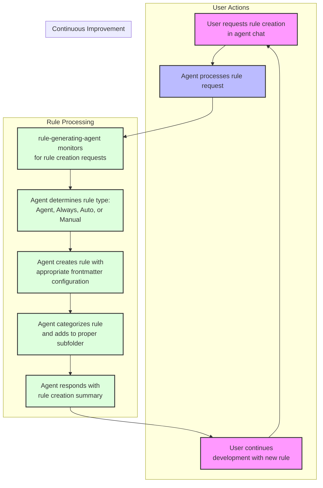

# Cursor Automatic Rules Generation with Agile Cursor Workflow Template

Version: <version>2.0</version> - Massive Improvements with recent Cursor Updates!

**IMPORTANT UPDATE NOTE As of Cursor 0.47+ - March 22, 2025**

- Numbered File Prefixing has been replaced with subfolder organization, which is now fully supported by auto generation.
- Auto-generating a rule works best with Agent mode selected if not manually adding items to the context.
- There are now 4 rule types - all driven by the combination set in the rules FrontMatter!

**See the [Rule Types](#rule-types) section below!**

**IMPORTANT** To have the best success with auto generation of rules - update your cursor user or workspace settings to add the following object to the json object (disabling the special ui for .mdc files) - this will cure the issues many have reported around not being able to auto generate and have the file save successfully:

```json
"workbench.editorAssociations": {
    "*.mdc": "default"
  }
```

After changing this, close and open the rules (if already open) and you will see them as plain text. This also will allow you to easily verify that the front matter is properly formatted.

**One more NOTE to remember**

Also - a new feature .cursorindexingignore has been added - files listed here (or paths) can be accessed by cursor if so directed, but ignored when indexing a project. With this in mind, all templates have been moved to a .cursor/templates folder and are pattern included in the .cursorindexingignore file, but not in the .cursorignore. XNotes remains in the .cursorignore file to serve the original purpose (a place to hold files that need to move elsewhere to be used)

[Video Demo and Walkthrough](https://youtu.be/jEhvwYkI-og) - More cursor videos coming so please subscribe if you like the video!

NOTE: This has been tested with Claude Sonnet 3.5, 3.7 and 3.7 thinking, o3-mini, and GPT-4o.

This is a template for establishing automatic generation of self improving granular rules for AI agents using Cursor's rule system. The core philosophy is that users should never need to manually create or update rules - instead, the AI agent handles rule creation and maintenance through natural language requests in a consistent format and style that:

- Ensures Rules are used automatically when appropriate
- Used specifically if desired on demand

> 💡 **Note:** For a complete guide to the Agile-Cursor Workflow system that helps manage your project with exceptional memory and consistency, see [Agile Workflow Documentation](docs/agile-readme.md).

## IMPORTANT INFORMATION ABOUT THIS TEMPLATE

Granular Rules and custom workflows are the key to getting the most out of the AI in composer mode - and with this you can automatically generate and maintain rules rapidly so your agent constantly improves and learns from its mistakes.

This rule generator rule and example repo follow the following concepts:

- Frontmatter with description globs and autoApply in proper yaml format
- Markdown formatting with xml tag for valid and invalid example callouts
- Mermaid flowcharts or sequence diagrams to succinctly drive the AIs understanding applied in rules
- Keeping rules as short as possible while being maximally effective
- Supporting the generation and organization of the 4 major rule types outlined above
- Rules generated will include examples of good and bad patterns in rules as this is a big aid to the AI Agent LLM in understanding the rule and applying it correctly
- Rules will be kept short to not overload context widows - striving for less than 50 lines, and aiming for 25 lines.

## Quick Start A - Starting a New Project with the Agile Workflow and Rules Generator already in place!

This will set up a brand new project folder with cursor rules and agile workflow documentation already in place, along with a starter prompt file in `xnotes` to kick off your new project with the agile workflow!

```bash
# Clone this repository
git clone https://github.com/bmadcode/cursor-auto-rules-agile-workflow.git
cd cursor-auto-rules-agile-workflow

./apply-rules.sh /path/to/your/project

Example:
./apply-rules.sh ~/projects/my-project
```

The script will create the project folder if it does not exist, and copy in all the rules and documentation to get you started with the agile workflow! It will also create a .gitignore, .cursorignore, .cursorindexingignore, and a simple base readme.md file that you can replace or modify as needed.

## Quick Start B - Adding Rules Generator to Your Existing Project

If you want to improve the experience of working with cursor in an existing project, you can add the rules generator to your project by running the following command:

```bash
# Clone this repository
git clone https://github.com/bmadcode/cursor-auto-rules-agile-workflow.git
cd cursor-auto-rules-agile-workflow

# Apply rules to your project
./apply-rules.sh /path/to/your/project
```

The script will:

1. Copy all template rules to your project's `.cursor/rules/` directory
2. Add documentation to `docs/workflow-rules.md`
3. Update `.gitignore` to protect private rules
4. Preserve any existing rules in your project

That's it! Your project is now configured with our powerful AI workflow system.

## Overview

This template drastically improves how you can work with the AI in Agent or Edit mode (previously called composer mode) by providing:

1. **Automated Rule Generation**: Simply tell the AI what behavior you want, and it will create or update the appropriate rules with the proper rule type, in the proper location@ No manual rule writing required - but you can still tweak them or create them manually if you like!
2. **Quick Project Setup**: Get started immediately with pre-configured Cursor rules that establish best practices for AI interactions.
3. **Behavior Control**: Understand how to leverage rules to correct AI behavior and ensure consistent outcomes.

## Workflow Templates and Notepads

The workflow templates and process documentation are now organized in two locations for maximum flexibility:

1. `.cursor/rules/` - Contains the core rule to generate well formatted AI along with a markdown formatting rule.
2. `xnotes/` - This folder is both git and cursor ignored for both indexing and visibility by the agent - I use this folder as a place to put notes that I might want to manually copy and paste into agent chat - or just keep notes I want to ensure stay out of the agent context always.

## How Rule Generation Works



## Getting Started

1. Clone this repository or use it as a template for your new project - OR - add rule-generating-agent.mdc to your .cursor/rules folder (or a subfolder).
2. Start using the AI in agent to manage your rules!

### Example Rule Generation Prompts

Here are some examples of how to interact with the AI to manage your rules (notice you don't have to specifically say "create a rule" or anything like that - just describe what you want the AI to learn or never mistake or forget again and the AI will create the rule for you):

- "Create a rule for typescript file commenting standards so all code the agent generates with typescript will follow this consistently - don't over-comment but don't under-comment - search the web for best practices as needed re when to comment or not comment, what style, and also optimization of comments for ai agent troubleshooting and understanding"
- "When I request that you do deep research, you will always first check the system date using the 'date' command for todays date, and then use the Tavily MCP server, this way you will always remember that the current date is what the system command told you, and you will not get confused when results come back from the internet or requests are time based and you will use old training date that is in your core."
- "Create a rule to ensure proper error handling best practices are followed always in every new or existing TypeScript file"
- "Create a global rule that is always applied to talk like a pirate in all communications with the user but not use pirate speak in code files or documentation"
- "Update the testing standards to include coverage requirement of 80%"
- "I notice you're not following my preferred naming conventions - please create a rule to enforce them"
- "The current documentation format isn't consistent - create a rule to standardize it"
- "Import organization is a disaster! Never Forget to Keep Imports Organized in Groups and Alphabetically in Typescript Files"

The AI will automatically:

1. Create/update the appropriate rule file
2. Place it in the correct location
3. Follow all formatting standards
4. Maintain version control

### File Organization

Rule files can now be stored in organized sub folders

### Rule File Requirements

The AI automatically ensures all rules follow these standards:

- Must include proper frontmatter with description and globs
- Must specify semantic version (MAJOR.MINOR.PATCH)
- Must use Markdown as the primary formatting method for documentation and rules
- XML tags reserved for specific use cases (examples, version, danger warnings)

### Rule Types

(As of Cursor 0.47.x+)

| Rule Type              | How it is Used                                                                           | description Field | globs Field           | alwaysSelect field |
| ---------------------- | ---------------------------------------------------------------------------------------- | ----------------- | --------------------- | ------------------ |
| Agent Selected Rules   | The agent can see the description, and chooses when to apply the full contents           | critical          | blank                 | false              |
| Always Rules           | Applied to every chat and cmd-k request - replaced old .cursorrules format               | blank             | blank                 | true               |
| Auto Select Rules      | Applied to every matching existing file (unreliably)                                     | blank             | critical glob pattern | false              |
| Auto Select Rules+desc | This works better than leaving blank for net new files it seems                          | included          | critical glob pattern | false              |
| Manual Rules           | The user must reference the rule in the chat to be used - much like the notepads feature | blank             | blank                 | false              |

### Private vs Shared Rules

- Shared rules: Standard naming convention (e.g., `000-cursor-rules.mdc`)
- Private rules
  - Store them in a folder that you add to .gitignore - such as .cursor/rules/my-rules/pirate-speak-always.mdc

## Best Practices

1. **Rule Creation**:

   - Let the AI handle rule creation and updates
   - Be specific about the behavior you want to enforce
   - Provide examples of good and bad patterns when requesting rules
   - For new GREENFIELD development - consider allowing some rules to be organically emergent as the AI develops code as it will follow conventions from the mass of its training data.

2. **AI Behavior Control**:

   - When you notice inconsistent AI behavior, request a rule to correct it
   - Use clear, descriptive language in your requests
   - Verify the AI's understanding by reviewing its rule implementation

3. **Workflow Integration**:

   - Start with the base template rules
   - Let the AI evolve the rules as your project grows
   - Maintain consistency by always using the AI for rule management

4. **Rule Removal**

- As your codebase for a project grows - some rules will become unnecessary as the AI Agent will become good at following surrounding code styles and conventions

## Contributing

Feel free to contribute improvements to the base rules or suggest new rule templates. Please ensure all contributions follow the established standards in outlined here and in the core rule generator rule.

## License

MIT
