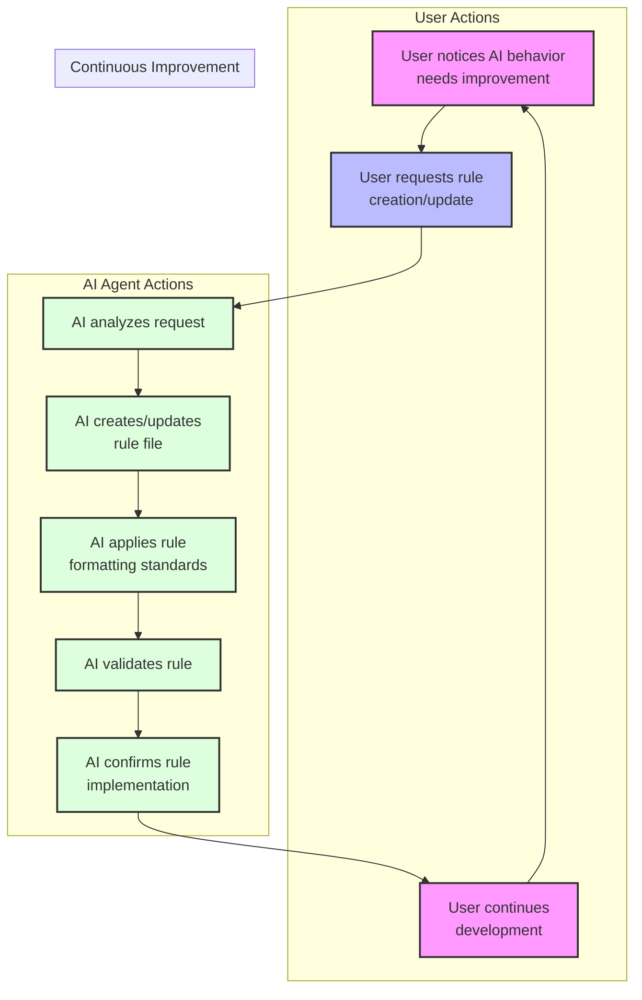

# Cursor Automatic Rules Generation with Agile Cursor Workflow Template

This is a template for establishing automatic generation of self improving granular rules for AI agents using Cursor's rule system. The core philosophy is that users should never need to manually create or update rules - instead, the AI agent handles rule creation and maintenance through natural language requests in a consistent format and style that:

- Ensures Rules are used automatically when appropriate
- Used specifically if desired on demand
- Does not suffer from write issues where other rule systems fail

> 💡 **Note:** For a complete guide to the Agile-Cursor Workflow system that helps manage your project with exceptional memory and consistency, see [Agile Workflow Documentation](docs/agile-readme.md).

## Quick Start - Adding Rules Generator to Your Project

Getting started with the ability to generate rules in your project is incredibly simple! Just run this deployment script to upgrade your project to use the latest rule and agile workflow xnotes:

```bash
# Clone this repository
git clone https://github.com/bmadcode/cursor-auto-rules-agile-workflow.git
cd cursor-auto-rules-agile-workflow

# Apply rules to your project
./apply-rules.sh /path/to/your/project
```

The script will:

1. Copy all template rules to your project's `.cursor/rules/` directory
2. Add documentation to `docs/workflow-rules.md`
3. Update `.gitignore` to protect private rules
4. Preserve any existing rules in your project

That's it! Your project is now configured with our powerful AI workflow system.

## Overview

This template drastically improves how you can work with the AI in composer mode by providing:

1. **Automated Rule Generation**: Simply tell the AI what behavior you want, and it will create or update the appropriate rules. No manual rule writing required!
2. **Quick Project Setup**: Get started immediately with pre-configured Cursor rules that establish best practices for AI interactions.
3. **Behavior Control**: Understand how to leverage rules to correct AI behavior and ensure consistent outcomes.

## Workflow Templates and Notepads

The workflow templates and process documentation are now organized in two locations for maximum flexibility:

1. `.cursor/rules/` - Contains the core rule to generate well formatted AI optimized rules along with some workflow templates (901-prd.mdc, 902-arch.mdc, 903-story.mdc) that are automatically applied when working with corresponding file types if you are going to follow the agile workflow outlined in the agile-readme.md file.
2. `xnotes/` - Contains workflow documentation and templates that can be used with Cursor's Notepads feature for a more lightweight approach pr applied to rules for AI instead.

### xnotes

These are files that are cursor ignored so they are not indexed into the project and are not used by the AI. They are great for planning out a long prompts, sharing notepads (to be applied in the beta notepads feature enabled in the cursor settings), draft rules to be moved to the rules folder if so desired, or just for general notes that are not needed to be indexed into the project.

## How Rule Generation Works



## Getting Started

1. Clone this repository or use it as a template for your new project
2. Ensure the `.cursor` directory and its contents are preserved
3. Start using the AI agent to manage your rules!

### Example Rule Generation Prompts

Here are some examples of how to interact with the AI to manage your rules:

```
"Create a rule to ensure proper error handling in TypeScript files"
"Update the testing standards to include coverage requirement of 80%"
"I notice you're not following our naming conventions - please create a rule to enforce them"
"The current documentation format isn't consistent - create a rule to standardize it"
"You're not properly organizing imports - please create a rule so you will never forget this again when working in typescript files"
```

The AI will automatically:

1. Create/update the appropriate rule file
2. Place it in the correct location
3. Follow all formatting standards
4. Maintain version control

### File Organization

The AI maintains rules in the following structure:

- All rules must be placed in `.cursor/rules/` directory
- Files must use the `.mdc` extension
- Follow the prefix-based classification system:
  - `0XX`: Core rules and standards
  - `1XX`: Tool and MCP rules
  - `3XX`: Testing standards
  - `8XX`: Workflow rules
  - `9XX`: Templates
  - `1XXX`: Language-specific rules
  - `2XXX`: Framework/library rules

### Rule File Requirements

The AI automatically ensures all rules follow these standards:

- Must include proper frontmatter with description and globs
- Must specify semantic version (MAJOR.MINOR.PATCH)
- Must use Markdown as the primary formatting method for documentation and rules
- XML tags reserved for specific use cases (examples, version, danger warnings)

### Private vs Shared Rules

- Shared rules: Standard naming convention (e.g., `000-cursor-rules.mdc`)
- Private rules: Prefixed with underscore (e.g., `_custom-personality.mdc`)
  - Used for individual preferences
  - Automatically gitignored
  - Won't impact team members
  - consider using notepads instead of personal rules

## Best Practices

1. **Rule Creation**:

   - Let the AI handle rule creation and updates
   - Be specific about the behavior you want to enforce
   - Provide examples of good and bad patterns when requesting rules

2. **AI Behavior Control**:

   - When you notice inconsistent AI behavior, request a rule to correct it
   - Use clear, descriptive language in your requests
   - Verify the AI's understanding by reviewing its rule implementation

3. **Workflow Integration**:
   - Start with the base template rules
   - Let the AI evolve the rules as your project grows
   - Maintain consistency by always using the AI for rule management

## Contributing

Feel free to contribute improvements to the base rules or suggest new rule templates. Please ensure all contributions follow the established standards in `000-cursor-rules.mdc`.

## License

MIT
