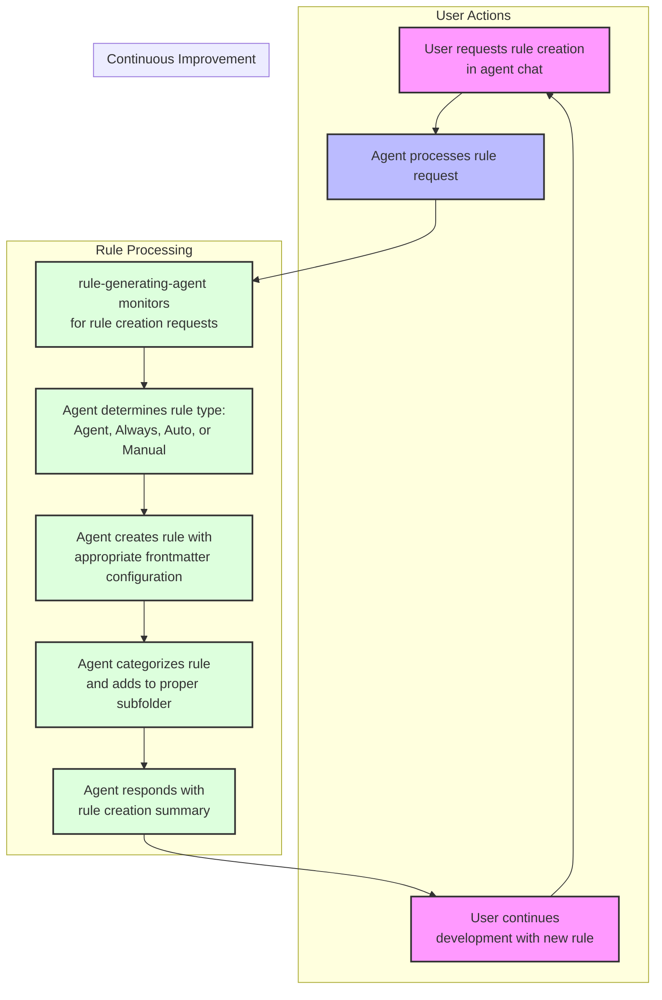

# Cursor Automatic Rules Generation with Agile Workflow Template

Cursor Version Applicability: 0.46+

## Important Updates (March 22, 2025)

- Subfolder organization replaces numbered file prefixing and is fully supported by auto generation
- Agent mode recommended for rule generation
- Four distinct rule types available - see [Rule Types](#rule-types) section

> 💡 **IDE Setting HIGHLY Suggested:** For best results with rule generation, update your Cursor settings by adding:
>
> ```json
> "workbench.editorAssociations": {
>   "*.mdc": "default"
> }
> ```
>
> This prevents UI rendering issues with .mdc files and ensures proper save functionality.

## Files Excluded from Indexing

The `.cursorindexingignore` feature allows certain files to be accessible but excluded from indexing:

- Templates moved to `.cursor/templates` folder
- Included in `.cursorindexingignore` but not in `.cursorignore`
- XNotes remains in `.cursorignore` (files that need to move elsewhere to be used)

[Video Demo and Walkthrough](https://youtu.be/jEhvwYkI-og) - Subscribe for more Cursor tutorials!

> 💡 **Compatibility:** Tested with Claude Sonnet 3.5, 3.7, 3.7 Thinking, o3-mini, and GPT-4o.

## Overview

This template dramatically improves AI workflows in Agent/Edit mode by providing:

1. **Automated Rule Generation:** Create and update rules through natural language requests
2. **Consistent AI Behavior:** Rules are applied automatically when appropriate or on demand
3. **Quick Project Setup:** Pre-configured best practices for AI interactions

> 💡 **Note:** For a complete guide to the Agile-Cursor Workflow system, see [Agile Workflow Documentation](docs/agile-readme.md).

## Key Concepts

- Rules use frontmatter with proper YAML format (description, globs, alwaysApply)
- Markdown formatting with XML tags for examples
- Mermaid diagrams for visual clarity
- Short, focused rules (target: 25 lines, maximum: 50 lines)
- Four rule types with organized subfolder structure
- Examples of good/bad patterns to guide AI understanding

## Quick Start Options

### A) New Project Setup

Start a new project with the Agile Workflow and Rules Generator:

```bash
# Clone this repository
git clone https://github.com/bmadcode/cursor-auto-rules-agile-workflow.git
cd cursor-auto-rules-agile-workflow

# Create new project with rules
./apply-rules.sh /path/to/your/project

# Example:
./apply-rules.sh ~/projects/my-project
```

The script creates your project folder (if needed) with all rules, documentation, and configuration files to start with the agile workflow.

### B) Add to Existing Project

Enhance your current project with the rules generator:

```bash
# Clone this repository
git clone https://github.com/bmadcode/cursor-auto-rules-agile-workflow.git
cd cursor-auto-rules-agile-workflow

# Apply rules to your project
./apply-rules.sh /path/to/your/project
```

The script will:

1. Copy template rules to your project's `.cursor/rules/` directory
2. Add workflow documentation
3. Update `.gitignore` to protect private rules
4. Preserve any existing rules

## How Rule Generation Works



## Example Rule Generation Prompts

No need to explicitly say "create a rule" - just describe the desired behavior:

- "Create a typescript file commenting standard that balances thoroughness with brevity"
- "When doing deep research, always check the system date with the 'date' command and use Tavily MCP"
- "Ensure proper error handling in all TypeScript files"
- "Talk like a pirate in communications but not in code or documentation"
- "Update testing standards to require 80% coverage"
- "Enforce consistent naming conventions in my code"
- "Standardize documentation formats"
- "Keep imports organized in groups alphabetically in TypeScript files"

The AI automatically:

1. Creates/updates the rule file
2. Places it in the correct location
3. Follows formatting standards
4. Maintains version control

## Rule Types

| Rule Type        | Usage                                            | description Field | globs Field           | alwaysApply field |
| ---------------- | ------------------------------------------------ | ----------------- | --------------------- | ----------------- |
| Agent Selected   | Agent sees description and chooses when to apply | critical          | blank                 | false             |
| Always           | Applied to every chat and cmd-k request          | blank             | blank                 | true              |
| Auto Select      | Applied to matching existing files               | blank             | critical glob pattern | false             |
| Auto Select+desc | Better for new files                             | included          | critical glob pattern | false             |
| Manual           | User must reference in chat                      | blank             | blank                 | false             |

## Private vs Shared Rules

- **Private rules:** Store in a folder added to .gitignore (e.g., `.cursor/rules/my-rules/pirate-speak-always.mdc`)

## Best Practices

### Rule Creation

- Let AI handle rule creation and updates
- Be specific about desired behaviors
- Provide examples of good/bad patterns
- For new projects, allow organic rule emergence

### AI Behavior Control

- Create rules when noticing inconsistent behavior
- Use clear, descriptive language
- Verify AI understanding by reviewing rules

### Workflow Integration

- Start with template rules
- Let AI evolve rules as your project grows
- Maintain consistency using AI for rule management

### Rule Removal

- Some rules become unnecessary as codebase grows as the AI will follow surrounding code styles and conventions
- The minimal amount of rules, the better - so prune rules as the codebase changes or models improve

## Contributing

Contributions to improve base rules or suggest new templates are welcome. Please follow the established standards.

## License

MIT 🚀
