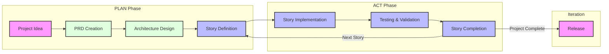

# Cursor Workflow Rules Template

This repository serves as a foundational template for establishing AI-driven workflow automation using Cursor's rule system. The core philosophy is that users should never need to manually create or update rules - instead, the AI agent handles rule creation and maintenance through natural language requests.

## Overview

This template revolutionizes how you work with AI by providing:

1. **Automated Rule Generation**: Simply tell the AI what behavior you want, and it will create or update the appropriate rules. No manual rule writing required!
2. **Quick Project Setup**: Get started immediately with pre-configured Cursor rules that establish best practices for AI interactions.
3. **Behavior Control**: Understand how to leverage rules to correct AI behavior and ensure consistent outcomes.
4. **Agile-Cursor Workflow**: Access to a powerful workflow system that guides projects from conception to completion.

## How It Works


The diagram above illustrates the seamless interaction between users and the AI agent in maintaining and evolving rules. Users simply communicate their needs in natural language, and the AI handles all the technical details of rule creation and maintenance.

## Getting Started

1. Clone this repository or use it as a template for your new project
2. Ensure the `.cursor` directory and its contents are preserved
3. Start using the AI agent to manage your rules!

### Example Rule Generation Prompts

Here are some examples of how to interact with the AI to manage your rules:

```
"Create a rule to ensure proper error handling in TypeScript files"
"Update the testing standards to include coverage requirement of 80%"
"I notice you're not following our naming conventions - please create a rule to enforce them"
"The current documentation format isn't consistent - create a rule to standardize it"
"You're not properly organizing imports - please create a rule so you will never forget this again when working in typescript files"
```

The AI will automatically:

1. Create/update the appropriate rule file
2. Place it in the correct location
3. Follow all formatting standards
4. Maintain version control

## The Agile-Cursor Workflow (@801)

The `801-agile-cursor.mdc` rule defines a comprehensive workflow for project management and implementation. This powerful system can be utilized in two ways:

1. **Per-Conversation Basis**: Add the `@801` tag at the start of your conversation with the AI
2. **Default Workflow**: Include in your base or app Cursor rules to make it the default working mechanism



The diagram above shows the streamlined flow from project conception through completion, with clear separation between planning and action phases. Each story goes through the complete cycle, ensuring controlled and validated progress.

### Key Workflow Features

- **Structured Documentation**:
  - PRD (Product Requirements Document)
  - ARCH (Architecture Decision Records)
  - Story tracking
- **Phase-Based Development**:

  - PLAN phase: Focus on documentation and planning
  - ACT phase: Implementation of approved stories 1 at a time

- **Controlled Progress**:
  - Single story implementation at a time
  - Clear status progression (draft -> in_progress -> complete)
  - Required approvals before implementation

### Workflow Sequence

1. **Planning Phase** (Documentation Focus)

   - PRD creation and approval
   - Architecture decisions and documentation
   - Story creation and refinement

2. **Action Phase** (Implementation Focus)
   - Story-by-story implementation
   - Task-level tracking
   - Continuous testing and validation

## Rule System Architecture

> Note: This section describes the internal structure maintained by the AI agent. Users typically don't need to interact with these details directly.

### File Organization

The AI maintains rules in the following structure:

- All rules must be placed in `.cursor/rules/` directory
- Files must use the `.mdc` extension
- Follow the prefix-based classification system:
  - `0XX`: Core rules and standards
  - `1XX`: Tool and MCP rules
  - `3XX`: Testing standards
  - `8XX`: Workflow rules
  - `9XX`: Templates
  - `1XXX`: Language-specific rules
  - `2XXX`: Framework/library rules

### Rule File Requirements

The AI automatically ensures all rules follow these standards:

- Must include proper frontmatter with description and globs
- Must specify semantic version (MAJOR.MINOR.PATCH)
- Must use Markdown as the primary formatting method for documentation and rules
- XML tags reserved for specific use cases (examples, version, danger warnings)

### Private vs Shared Rules

- Shared rules: Standard naming convention (e.g., `000-cursor-rules.mdc`)
- Private rules: Prefixed with underscore (e.g., `_custom-personality.mdc`)
  - Used for individual preferences
  - Automatically gitignored
  - Won't impact team members

## Creating New Rules

Rules are primarily created through natural language requests to the AI agent. Simply describe the behavior you want to enforce or change, and the AI will handle the technical details.

### Example Scenarios

1. **Correcting AI Behavior**:

   ```
   User: "You're not properly documenting function parameters. Please create a rule to fix this."
   AI: "I'll create a rule to enforce comprehensive function documentation standards..."
   ```

2. **Enforcing Team Standards**:

   ```
   User: "We need to ensure all React components follow the same structure. Create a rule for this."
   AI: "I'll create a component structure rule with proper examples and validation..."
   ```

3. **Updating Existing Rules**:
   ```
   User: "The current testing rule isn't strict enough. Please update it to require 90% coverage."
   AI: "I'll update the testing standards rule with the new coverage requirements..."
   ```

### Technical Details

> Note: For reference purposes only - the AI handles these details automatically

## Best Practices

1. **Rule Creation**:

   - Let the AI handle rule creation and updates
   - Be specific about the behavior you want to enforce
   - Provide examples of good and bad patterns when requesting rules

2. **AI Behavior Control**:

   - When you notice inconsistent AI behavior, request a rule to correct it
   - Use clear, descriptive language in your requests
   - Verify the AI's understanding by reviewing its rule implementation

3. **Workflow Integration**:
   - Start with the base template rules
   - Let the AI evolve the rules as your project grows
   - Maintain consistency by always using the AI for rule management

## Contributing

Feel free to contribute improvements to the base rules or suggest new rule templates. Please ensure all contributions follow the established standards in `000-cursor-rules.mdc`.

## License

MIT
